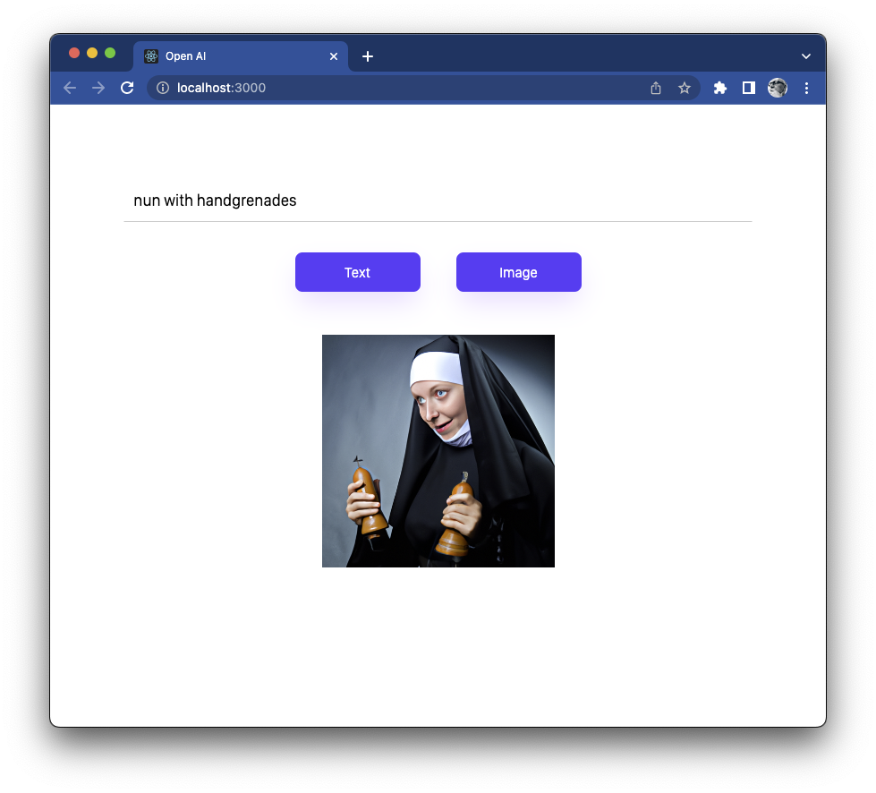

In deze special gaan we onze eigen very-light versies van [ChatGPT](https://openai.com/blog/chatgpt/)
en [Dall-E-2](https://openai.com/dall-e-2/) maken. Dit doen we door gebruik te maken van de standaard [OpenAI library](https://openai.com/).
Klik vervolgens op het menu-item [API](https://openai.com/api/) en
sign up voor een account. Gebruik de optie "for personal use" zodat je geen credit-card-gegevens hoeft aan te leveren.

Voeg de API Key toe aan je `.env.local`-file in de root van het project

**Demo:** https://educom-ai.web.app/


```shell
REACT_APP_API_KEY=whatever-key-je-hebt-ontvangen
```




## Install

Repository: https://github.com/Educom-Opleidingen/openai-react-demo

**install**
```shell
git clone https://github.com/Educom-Opleidingen/openai-react-demo
yarn install
```

## Storybook
* Lokaal storybook: `yarn storybook`
* Gepubliceerd Storybook: https://educom-ai.web.app/storybook/